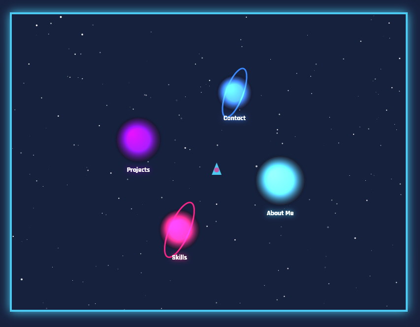

# 🚀 Space Portfolio - Juego Interactivo de Nave Espacial

## 📸 Captura de Pantalla

## 🚀 Tecnologías Usadas
- **JavaScript ES6+** (Canvas API, animaciones)
- **HTML5 & CSS3** (Flexbox, gradientes, animaciones)
- **Responsive Design** (Adaptado a móviles y desktop)
- **Eventos táctiles y de teclado** (Touch y Arrow Keys)
- **Git & GitHub Pages** (Despliegue automático)

## ⚡ Experiencia Galáctica
Creé un mini juego para mostrar mi portfolio con:
- **Nave espacial controlable** con animación de motor  
- **Planetas orbitando** con colores y efectos glow  
- **Interacción táctil y por teclado** para móvil y PC  
- **Panel de información dinámico** al acercarse a cada planeta  
- **Estrellas de fondo con parpadeo animado**  

## 📂 Estructura del Proyecto

### space-portfolio/
### ├── index.html  
### ├── style.css  
### ├── script.js  
### ├── assets/ (Imágenes, iconos SVG)  
### └── README.md  

## 💎 Características Destacadas

    ✅ Juego canvas 2D con animaciones suaves  
    ✅ Panel interactivo con contenido de About, Skills, Projects y Contact  
    ✅ Soporte táctil completo para móviles  
    ✅ Responsive adaptativo para varios tamaños de pantalla  
    ✅ Diseño limpio y moderno con gradientes y efectos glow  

## 📝 Licencia

MIT License - Libre para usar, modificar y compartir

## 💡 Pro Tip:  
La órbita de los planetas se calcula con funciones trigonométricas para movimiento realista y continuo.

## 🚧 Próximas Mejoras:

✨ Añadir sonidos y efectos de motor  
✨ Guardar progreso de planetas visitados  
✨ Mejorar colisiones y límites para nave  

## ⭐ ¿Te gustó el proyecto?  
¡Dejá una estrella en GitHub y compartilo! Este juego es mi forma de combinar creatividad y programación en un portfolio único.  
# ¡Gracias por explorar mi universo web! 🌌🚀
